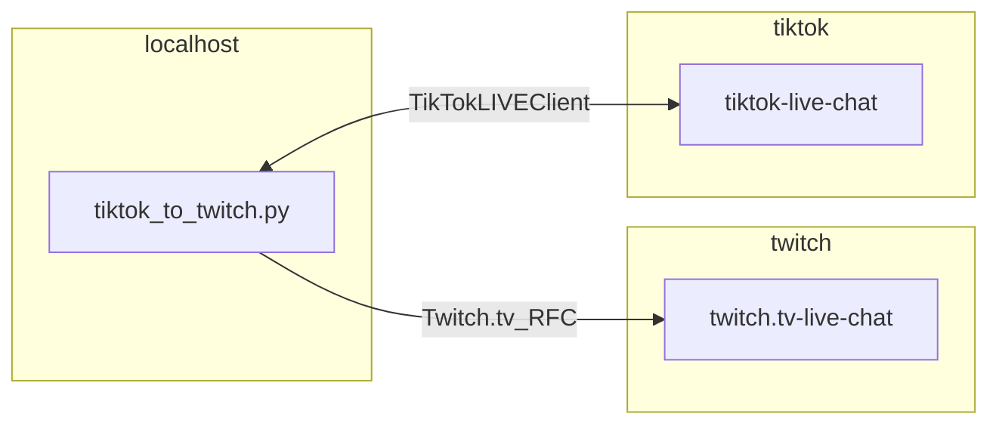

# tiktok_to_twitch
## Architecture

## Purpose
An integration that sends tiktok messages from a defined tiktok channel to a defined twitch chat, under "some_user" account (`tiktok_chatter` by default)

## How-to Deploy Service
Currently just a script, so the referenced python `import`s will need installed as well as python to execute the code:
1. `pip install <all_imports>`
    - Install the python dependencies
2. `cd tiktok-chat/app`
    - Change to the script's `app` directory
3. `python main.py`
    - Execute the main python script

**NOTE** (*REQUIRED BEFORE EXECUTION*): The current versioning would require the 'credentials' to be manually added to the script's source. This is *temporary*, until some TODOs are tackled (see below)

## Future-state
Make this script serviceable so end-user can execute more directly, and easily add credentials to a top-level local config

## TODO
- `build_config()` or similar for building and passing config values
- proper config value storage
- functional key rotation for RFC connection (`twitch.py` file)

## References
[TikTokLive](https://github.com/isaackogan/TikTokLive) Client
- Tiktok does not have a native API that allows Tiktok *live* stream/chat integration, so this 3rd party source is leveraged

[Twitch IRC](https://dev.twitch.tv/docs/irc/send-receive-messages/)
- Twitch IRC is leveraged to send messages to Twitch chat. [This article](https://www.learndatasci.com/tutorials/how-stream-text-data-twitch-sockets-python/) is a good high level example of usage

[Twitch Auth](https://dev.twitch.tv/docs/irc/authenticate-bot/)
- Twitch has a multilayered implicit grant flow for token generation to authenticate securely. [This app](https://twitchapps.com/tmi/) can be used to generate the `oauth` token piece for auth